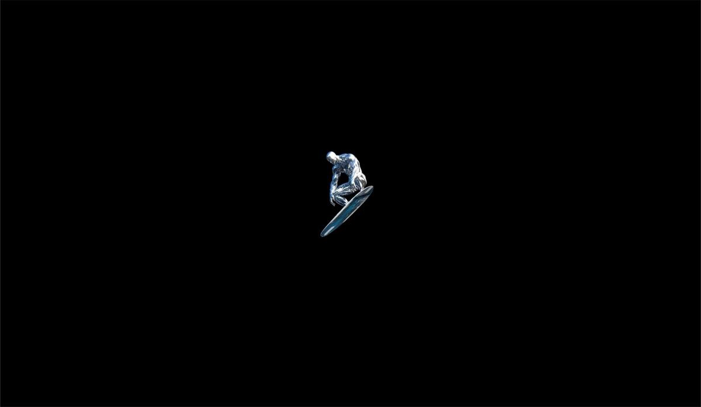

  <!-- Header Image -->
  

    

  <!-- Header Text -->
  <h1>Hi 👋, I'm Keegan</h1>
  <h3>Support Specialist / Engineer</h3>

   

---

### 💻 Tech Stack

  <!-- Interactive Skill Icons -->
  

 

  <!-- Systems & Infrastructure Badges -->
  
  
  
  
  
  

---

### 🚀 About Me

I’m a support specialist by day (9–5) and an engineer by night (5–9). Over the years, I’ve found my drive in troubleshooting, resolving, building, and continuously deepening my understanding of real-world IT engineering.

I currently design and maintain a production-grade homelab featuring isolated virtual machines, containerized application stacks, edge routing, and zero-trust network architecture.

My goal is simple: **build stable, scalable systems, implement smart automation, and continuously advance in the field of IT Support & Systems Engineering.**

 

---

### 🤝 Connect

  

---

### 📊 GitHub Stats

  
  

 

  

